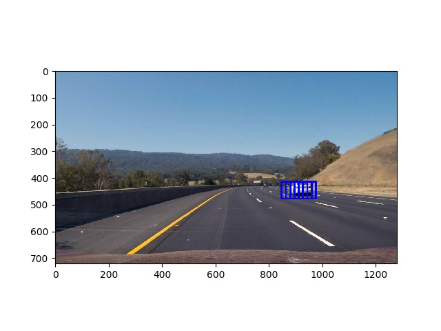

**Vehicle Detection Project**

The goals / steps of this project are the following:

* Perform a Histogram of Oriented Gradients (HOG) feature extraction on a labeled training set of images and train a classifier Linear SVM classifier
* Optionally, you can also apply a color transform and append binned color features, as well as histograms of color, to your HOG feature vector.
* Note: for those first two steps don't forget to normalize your features and randomize a selection for training and testing.
* Implement a sliding-window technique and use your trained classifier to search for vehicles in images.
* Run your pipeline on a video stream (start with the test_video.mp4 and later implement on full project_video.mp4) and create a heat map of recurring detections frame by frame to reject outliers and follow detected vehicles.
* Estimate a bounding box for vehicles detected.

[//]: # (Image References)
[image1]: ./examples/car_not_car.png
[image2]: ./examples/HOG_example.jpg
[image3]: ./examples/sliding_windows.jpg
[image4]: ./examples/sliding_window.jpg
[image5]: ./examples/bboxes_and_heat.png
[image6]: ./examples/labels_map.png
[image7]: ./examples/output_bboxes.png
[video1]: ./project_video.mp4


#### 1. Provide a Writeup / README that includes all the rubric points and how you addressed each one.
[Here](./writeup.md)

You're reading it!

### Histogram of Oriented Gradients (HOG)

#### 1. Explain how (and identify where in your code) you extracted HOG features from the training images.

The code for this step is contained in the in lines 32 of the file called [`features.py`](./src/features.py).

I started by reading in all the `vehicle` and `non-vehicle` images.

I then explored different color spaces and different `skimage.hog()` parameters (`orientations`, `pixels_per_cell`, and `cells_per_block`).
I tuning the parameters by training the classifier on hog features alone to see its accuracy,
following is some log example (full results can be found at [`log.txt`](./log.txt)):

```txt
# RGB
Using: 16 orientations 16 pixels per cell and 2 cells per block
Feature vector length: 1728
58.41 Seconds to train ModelType.DecisionTree...
Test Accuracy of ModelType.DecisionTree =  0.9071

# HSV
Using: 16 orientations 16 pixels per cell and 2 cells per block
Feature vector length: 1728
51.79 Seconds to train ModelType.DecisionTree...
Test Accuracy of ModelType.DecisionTree =  0.9251

# LUV
Using: 16 orientations 16 pixels per cell and 2 cells per block
Feature vector length: 1728
62.97 Seconds to train ModelType.DecisionTree...
Test Accuracy of ModelType.DecisionTree =  0.9535

# HLS
Using: 16 orientations 16 pixels per cell and 2 cells per block
Feature vector length: 1728
63.44 Seconds to train ModelType.DecisionTree...
Test Accuracy of ModelType.DecisionTree =  0.9296

# YUV
Using: 16 orientations 16 pixels per cell and 2 cells per block
Feature vector length: 1728
60.55 Seconds to train ModelType.DecisionTree...
Test Accuracy of ModelType.DecisionTree =  0.9457

# YCrCb
Using: 16 orientations 16 pixels per cell and 2 cells per block
Feature vector length: 1728
75.98 Seconds to train ModelType.DecisionTree...
Test Accuracy of ModelType.DecisionTree =  0.9496
```

Here is an example using the `Gray` color space and HOG parameters of `orientations=8`, `pixels_per_cell=(8, 8)` and `cells_per_block=(2, 2)`:


Code on hog features of 3D image can be found in line 52 of the file called [`features.py`](./src/features.py)
```python

def hog_features3D(img, hog_channel, orient,
                   pix_per_cell, cell_per_block):
    features = []
    if hog_channel == 'ALL':
        for channel in range(img.shape[2]):
            features.extend(hog_features2D(img[:, :, channel],
                            orient, pix_per_cell, cell_per_block,
                            vis=False, feature_vec=True))
    else:
        features = hog_features2D(img[:, :, hog_channel],
                                  orient,
                                  pix_per_cell, cell_per_block,
                                  vis=False, feature_vec=True)
    return features
```


#### 2. Explain how you settled on your final choice of HOG parameters.

I tried various combinations of parameters and see the accuracy of classifier, full results can be found at [`log.txt`](./log.txt).
Following is the final parameters for all feature extraction:
```python

color_space = 'HLS'  # Can be RGB, HSV, LUV, HLS, YUV, YCrCb
spatial_feat = True  # Spatial features on or off, None < 0, 768, 0.89
spatial_size = (16, 16)  # Spatial binning dimensions
hist_feat = True  # Histogram features on or off, 48, 0.9654
hist_bins = 16  # Number of histogram bins
hog_feat = True  # HOG features on or off, 1728, 0.885
orient = 16   # HOG orientations
pix_per_cell = 16  # HOG pixels per cell
cell_per_block = 2  # HOG cells per block
hog_channel = 'ALL'  # Can be 0, 1, 2, or "ALL"
name = ModelType.SVC
load_model = True

```

#### 3. Describe how (and identify where in your code) you trained a classifier using your selected HOG features (and color features if you used them).

Three models are trained:
 * Naive Bayes
 * DecisionTree
 * SVC with default kernel 'rbf'
 * linear SVC

At first beginning, I only trained the first three models and of course SVC with kernel `rbf` outperforms the most. Usually it is
accuracy can get higher than 99%, and decision tree is around 97%. But I also realize that svc with kernel `rbf` are quite
computational expensively. For single image, even after optization by extracting hog feature once,
it needs around 3s for three different window scale, however, for decision tree it only needs 0.5s.

Then I decide to go for linear SVC, it has accuracy as good as 98.4%,
but can be as efficient as Decision Tree in prediction/evaluation

### Sliding Window Search

#### 1. Describe how (and identify where in your code) you implemented a sliding window search.  How did you decide what scales to search and how much to overlap windows?

* I decided to search random window positions at random scales all over the image and with overlap 0.5:
* After it takes 20s for labeling each image, I implement more efficient on that extract hog feature once. Code is in the line 62 of the file called [`search.py`](./src/search.py)
* Further optimization are done


#### 2. Show some examples of test images to demonstrate how your pipeline is working.  What did you do to optimize the performance of your classifier?

Ultimately I searched on three search areas, scales, cells_per_step using HLS 3-channel HOG features plus spatially binned color and histograms of color in the feature vector, which provided a nice result.  Here are some example images:
```python

y_start_stop = [(350, 500), (400, 550), (350, 650)]
scale = [1, 2, 3]
cells_per_step = [1, 1, 1]

```





Code is in the file called [`P5.py`](./src/P5.py)

---

### Video Implementation

#### 1. Provide a link to your final video output.
Your pipeline should perform reasonably well on the entire project video (somewhat wobbly or unstable bounding boxes are ok as long as you are identifying the vehicles most of the time with minimal false positives.)
Here's a [link to my video result](./project_video_labeled.mp4)


#### 2. Describe how (and identify where in your code) you implemented some kind of filter for false positives and some method for combining overlapping bounding boxes.

I recorded the positions of positive detections in each frame of the video.  From the positive detections I created a heatmap and then thresholded that map to identify vehicle positions.
I then used `scipy.ndimage.measurements.label()` to identify individual blobs in the heatmap.
I then assumed each blob corresponded to a vehicle.  I constructed bounding boxes to cover the area of each blob detected.

I further filter the false positives by recording the center of blob (heatmap center with maximum value, car detected),
and remove those change windows that heatmap center less than a value

Please check Code is in the file called [`P5.py`](./src/P5.py) for all details

---

### Discussion

#### 1. Briefly discuss any problems / issues you faced in your implementation of this project.  Where will your pipeline likely fail?  What could you do to make it more robust?

* It is difficult to decide the cells_per_step/overlap ratio in traditional window search. Though it is ok to set it as smaller as possible (opposite for overlap ratio), but computation time increase expontially
    * One approach to furtuer improve efficiency is that we can use windows from last frame as starting points and do some search around those areas
* It might fail if car moving too fast relatively
    * For some two direction lane, this might happens for the car from other lane
    * Also for car that going different direction at ramp
* It might fail if weather is too bad
* It might fail if camera is shaking too much such as the road is bumping
* It might merge several cars into one
    * Try to get heat center and recording its size and smooth the size
* The bounding box is too large/small sometimes
    * try to record the center and smooth the size
* Computation is still too slow
    * Using C++ maybe


